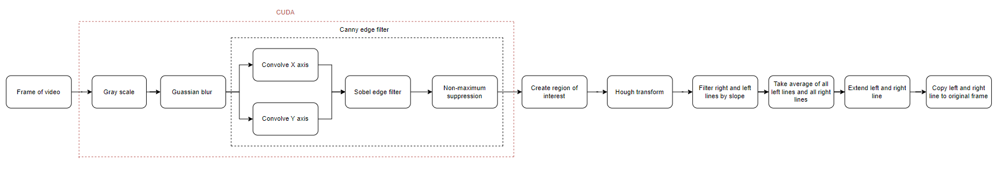

# Lane detection  

The goal of this project is to do a performance analysis between the CPU and GPU via a lane detection system used in self-driving cars.  

To address the (Nvidia) GPU, CUDA in python is used.  
Here below is the full pipeline of the project:  

The full performance analysis and explenation of the pipeline is described in the pdf document.  

## Modules  

Following modules are installed in order to run the python script in CUDA.  
I used Spyder to execute the scripts, but feel free to use whatever editor you want.  

### MODULES INSTALLED VIA CONDA  

* Python : 3.8.10
* Pip : 23.3
* Cudatoolkit : 11.8.0

### MODULES INSTALLED VIA PIP  

* Numba : 0.58.1
* Numpy : 1.24.4
* Opencv-python : 4.8.1.78
